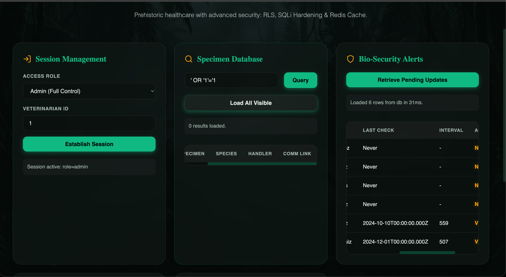
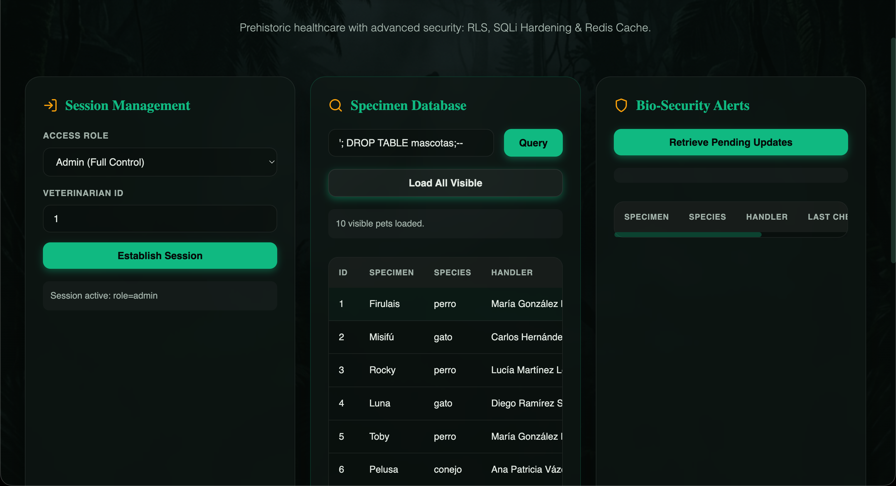
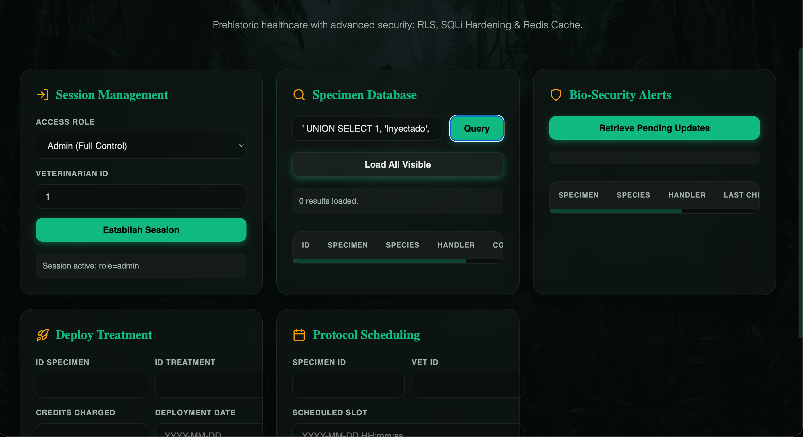
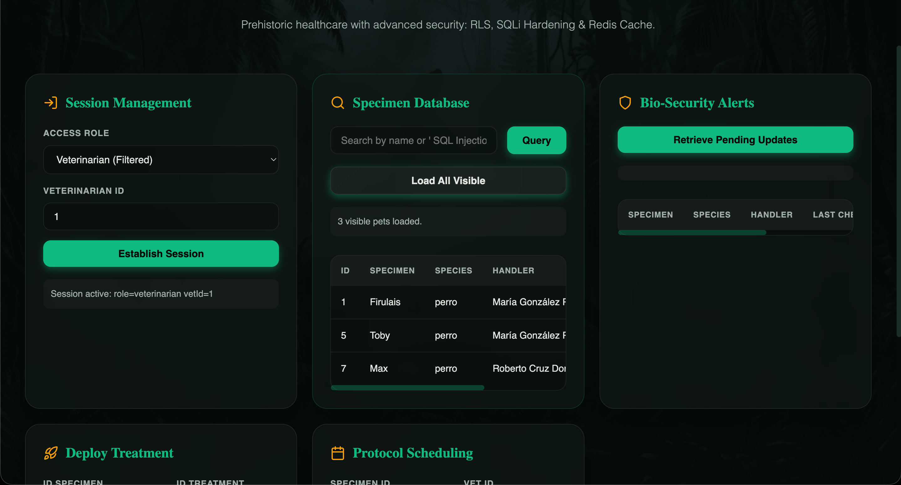
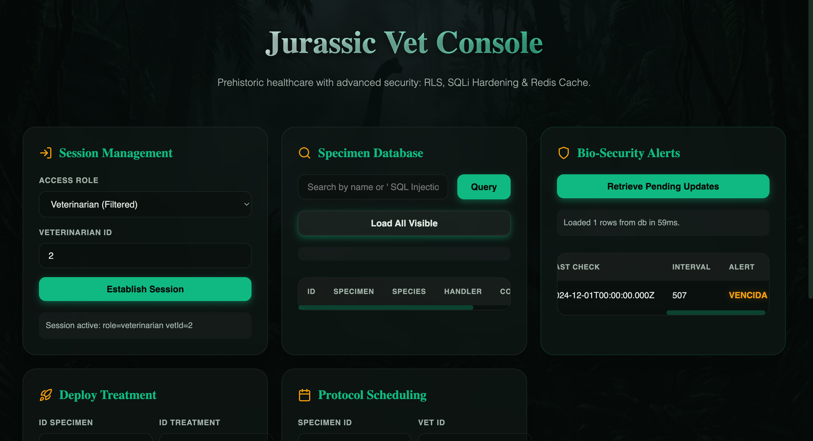
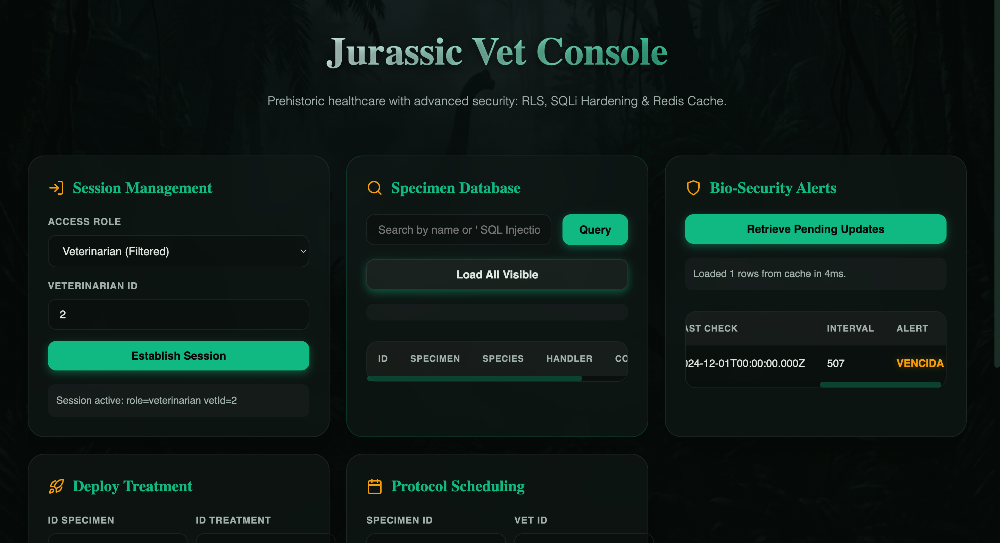
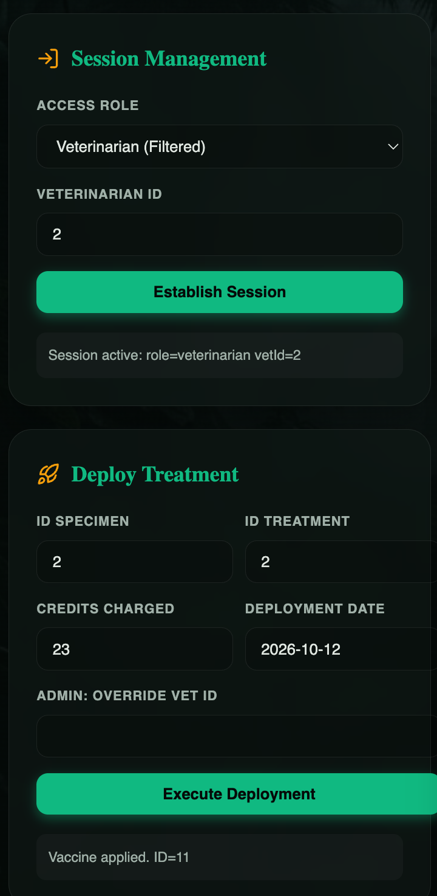
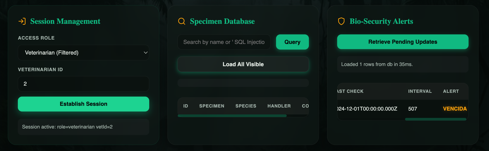
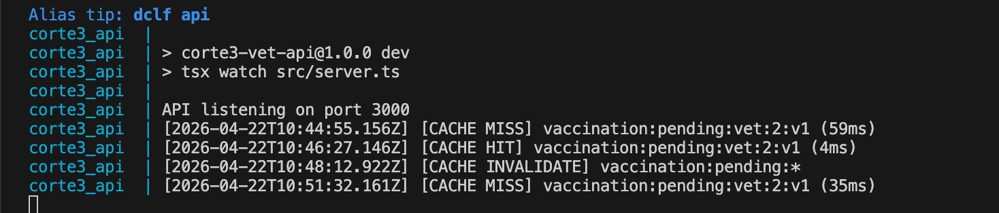

# Cuaderno de Ataques

Materia: Base de Datos Avanzadas
Proyecto: Corte 3 - Sistema de Seguridad para Clínica Veterinaria

## Sección 1 - Tres ataques de Inyección SQL que fallan

### Ataque 1: Escape clásico de comillas

- Input utilizado: `' OR '1'='1`
- Superficie en Frontend: Input de búsqueda de mascotas (`frontend/index.html`, sección "Pet Search")
- Ejemplo de petición:

```bash
curl -s "http://localhost:3000/api/pets/search?q=%27%20OR%20%271%27%3D%271" \
  -H "x-session-token: <vet_token>"
```



- Resultado observado: `{"rows":[]}` (sin ruptura de SQL, sin escalamiento de privilegios)
- Líneas defensivas en el backend:
  - `api/src/server.ts:91` (`ILIKE $1`)
  - `api/src/server.ts:97` (arreglo de parámetros vinculados `[%${parsed.q}%]`)

### Ataque 2: Intento de consulta apilada (Stacked query)

- Input utilizado: `'; DROP TABLE mascotas;--`
- Superficie en Frontend: Input de búsqueda de mascotas
- Ejemplo de petición:

```bash
curl -s "http://localhost:3000/api/pets/search?q=%27%3B%20DROP%20TABLE%20mascotas%3B--" \
  -H "x-session-token: <vet_token>"
```



- Resultado observado: `{"rows":[]}` y la tabla `mascotas` permanece intacta.

### Ataque 3: Intento de UNION (Union-Based SQLi)

- Input utilizado: `' UNION SELECT 1, 'Inyectado', 'Test', 'Hacker', '123456789'--`
- Superficie en Frontend: Input de búsqueda de mascotas
- Ejemplo de petición:

```bash
curl -s "http://localhost:3000/api/pets/search?q=%27%20UNION%20SELECT%201%2C%20%27Inyectado%27%2C%20%27Test%27%2C%20%27Hacker%27%2C%20%27123456789%27--" \
  -H "x-session-token: <vet_token>"
```



- Resultado observado: `{"rows":[]}` (No se devuelven las filas inyectadas porque el driver de base de datos trata el string literalmente como el valor exacto a buscar en lugar de código ejecutable).
- Línea defensiva en el backend:
  - `api/src/server.ts:97` (Paso seguro de variables a través del driver).

## Sección 2 - Prueba de funcionamiento de RLS

### Identidad: Veterinario 1 (vetId = 1)

Petición:

```bash
curl -s "http://localhost:3000/api/pets" -H "x-session-token: <vet1_token>"
```


Mascotas observadas: `Rex`, `Pelusa`, `Nala`.

### Identidad: Veterinario 2 (vetId = 2)

Petición:

```bash
curl -s "http://localhost:3000/api/pets" -H "x-session-token: <vet2_token>"
```


Mascotas observadas: `Misifú`, `Luna`, `Dante`.

### Política que causa este comportamiento

`infra/postgres/05_rls.sql:39` la política `mascotas_veterinarian_select` filtra por la asignación activa en `vet_atiende_mascota` y la identidad del veterinario de la sesión a través de `app_current_vet_id()`.

## Sección 3 - Prueba de funcionamiento del caché en Redis

### 1) Primera consulta -> MISS

Respuesta:

```json
{"source":"db","latencyMs":54,...}
```

Línea en logs:

```text
[2026-04-22T03:41:12.831Z] [CACHE MISS] vaccination:pending:reception:v1 (74ms)
```



### 2) Segunda consulta inmediata -> HIT

Respuesta:

```json
{"source":"cache","latencyMs":2,...}
```

Línea en logs:

```text
[2026-04-22T03:41:14.105Z] [CACHE HIT] vaccination:pending:reception:v1 (6ms)
```



### 3) Después de aplicar una vacuna -> INVALIDACIÓN

Se aplica una vacuna vía `POST /api/vaccines/apply`.
Línea en logs generada:

```text
[2026-04-22T03:45:10.000Z] [CACHE INVALIDATE] vaccination:pending:*
```


Si se vuelve a consultar el listado pendiente después de esto, se observará un nuevo `MISS` porque los datos cacheados fueron correctamente invalidados.

### 4) Tercera consulta después de la invalidación -> MISS de nuevo



### 5) Evidencia de logs

Captura completa de los `4 logs` con timestamps (en orden):


